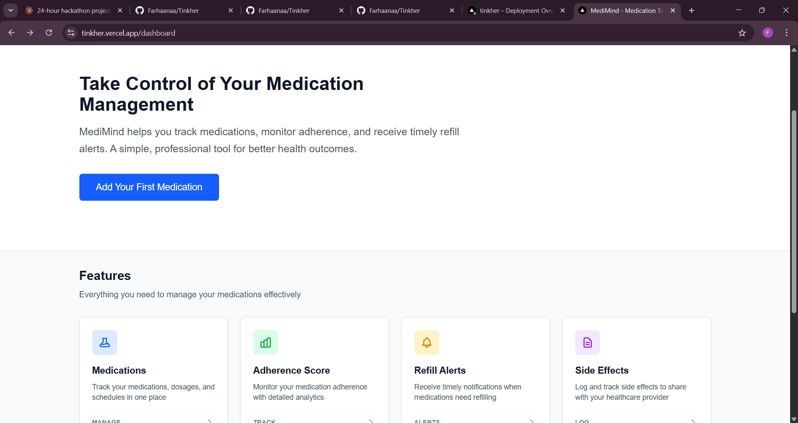
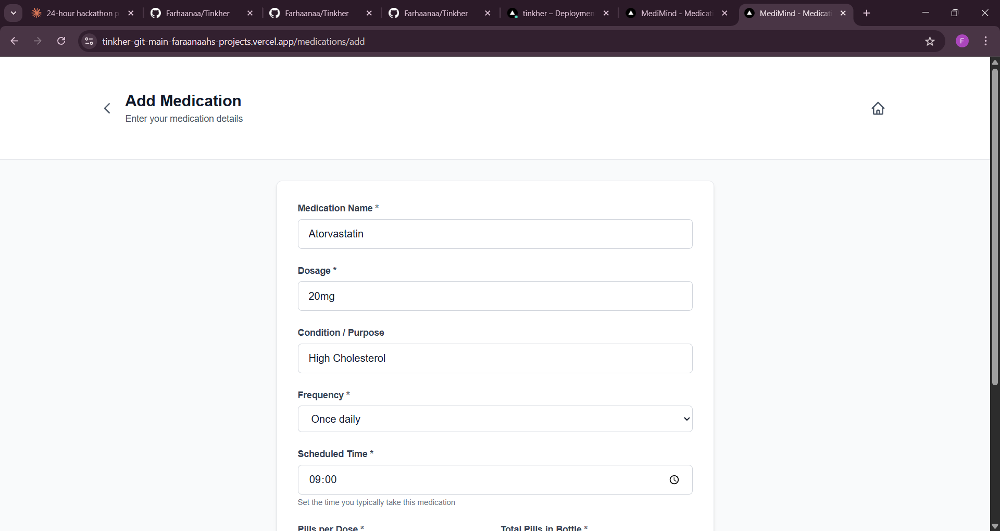
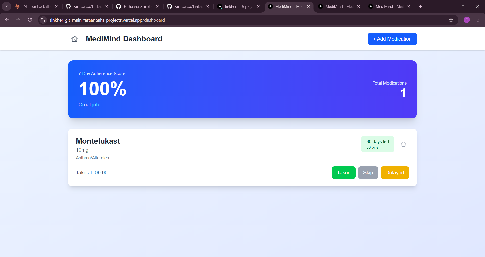

<p align="center">
  
</p>

# 🧠 MediMind 🎯

AI-Powered Medication Adherence & Risk Prevention System

---

## 🏷 Basic Details

### 👥 Team Name

**Jupiter**

### 👩‍💻 Team Members

- **Fathima Farhana K N**  
  Ilahia College of Engineering and Technology, Muvattupuzha

- **Blessy Maria Joseph**  
  Ilahia College of Engineering and Technology, Muvattupuzha

---

### 🌐 Hosted Project Link

tinkher.vercel.app

---

## 📖 Project Description

MediMind is an intelligent medication adherence and risk prevention system designed to help individuals consistently follow prescribed treatment plans.

The platform tracks medication intake, calculates adherence scores, detects risk patterns, and predicts refill needs to prevent treatment interruptions.

---

## ❗ The Problem Statement

Medication non-adherence is a major healthcare challenge worldwide. Nearly 50% of patients fail to follow prescribed medication schedules, leading to preventable complications, hospitalizations, and worsening health outcomes.

There is a need for a proactive, intelligent system that not only tracks medication intake but also identifies behavioral patterns that may indicate potential health risks.

---

## 💡 The Solution

MediMind provides:

- Medication registration and schedule setup
- Dose logging (Taken / Skipped / Delayed)
- Real-time adherence score calculation
- Risk alerts for repeated missed doses
- Refill prediction based on remaining pill count

The system transforms simple medication logs into meaningful health insights, enabling users to take better control of their treatment routines.

---

# 🛠 Technical Details

## 💻 Technologies/Components Used

### For Software:

- **Languages Used:** JavaScript, TypeScript
- **Frameworks Used:** Next.js (App Router), React
- **Libraries Used:** React Hooks
- **Tools Used:** VS Code, Git, GitHub

---

# ✨ Features

- 📋 Medication Registration
- ⏰ Dose Logging (Taken / Skipped / Delayed)
- 📊 Dynamic Adherence Score
- ⚠️ Intelligent Risk Alerts
- 💊 Refill Prediction System
- 📱 Clean & Responsive User Interface

---

# ⚙ Implementation

## 🔧 Installation

```bash
npm install
```

## ▶ Run

```bash
npm run dev
```

Then open:

```
http://localhost:3000
```

---

# 🏗 Architecture Overview

MediMind follows a client-side MVP architecture built for rapid development and stability under hackathon constraints.

The system uses:

- React state management
- localStorage for persistence
- Rule-based adherence and risk detection logic

The architecture is modular and scalable, allowing future integration with:

- Cloud databases (e.g., Supabase)
- User authentication systems
- AI-powered predictive analytics

---

# 📸 Screenshots

(Add at least 3 screenshots here)

Example:

  
_Home page displaying overview and navigation_

  
_Medication registration interface_

  
_Adherence score and risk alert display_

---

## 🏗 System Architecture

+------------------+
| USER |
+------------------+
|
v
+------------------+
| MediMind App |
| (Web Interface) |
+------------------+
|

---

| | |
v v v

+----------------+ +----------------+ +----------------+
| Log Taken Dose | | Log Skipped | | Inventory |
| | Delayed Dose | | Monitoring |
+----------------+ +----------------+ +----------------+
| | |
v v v

+----------------+ +----------------+ +----------------+
| Adherence | | Risk | | Refill |
| Calculation | | Calculation | | Prediction |
+----------------+ +----------------+ +----------------+
| | |

---

|
v
+------------------+
| Alert System |
| - Risk Alerts |
| - Low Stock |
+------------------+
|
v
+------------------+
| Display |
| - Adherence % |
| - Risk Level |
| - Refill Status |
+------------------+

---

## 🧠 Architecture Explanation

1. The **User** interacts with the MediMind web interface.
2. The system captures medication behavior:
   - Taken doses
   - Skipped or delayed doses
   - Remaining pill inventory
3. The logic engine processes:
   - Adherence calculation
   - Risk detection
   - Refill prediction
4. The Alert System generates:
   - Risk alerts
   - Low inventory warnings
5. Final results are displayed to the user with actionable insights.

# 🤖 AI Tools Used (Transparency Section)

**Tools Used:** ChatGPT, Claude

**Purpose:**

- Debugging assistance
- Code structuring guidance
- UI refinement suggestions
- Documentation drafting

**Human Contributions:**

- Architecture design and planning
- Core medication tracking logic
- Adherence calculation logic
- Risk detection rule design
- UI/UX decisions
- Integration and testing

---

# 👩‍💻 Team Contributions

### Fathima Farhana K N

- Frontend development
- Adherence scoring logic
- UI/UX structuring
- Project architecture
- Backend

### Blessy Maria Joseph

- Feature implementation
- Medication tracking logic
- Testing and refinement
- Documentation support

---

# 🚀 Future Enhancements

- Cloud database integration
- Secure user authentication
- Multi-device synchronization
- AI-powered personalized risk analysis

---

Made with ❤️ at TinkerHub  
**Team Jupiter**
